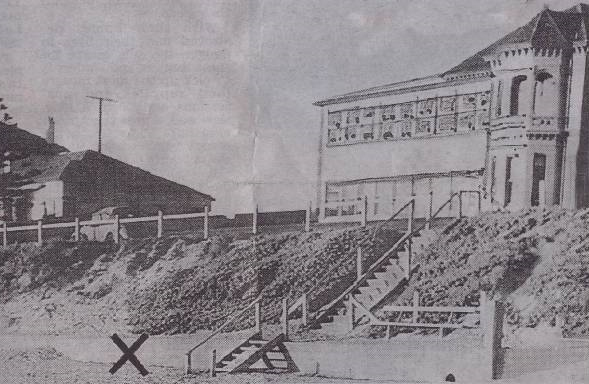
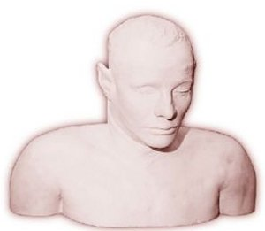
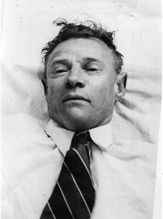
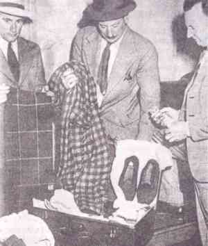
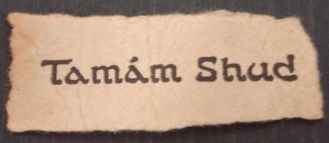
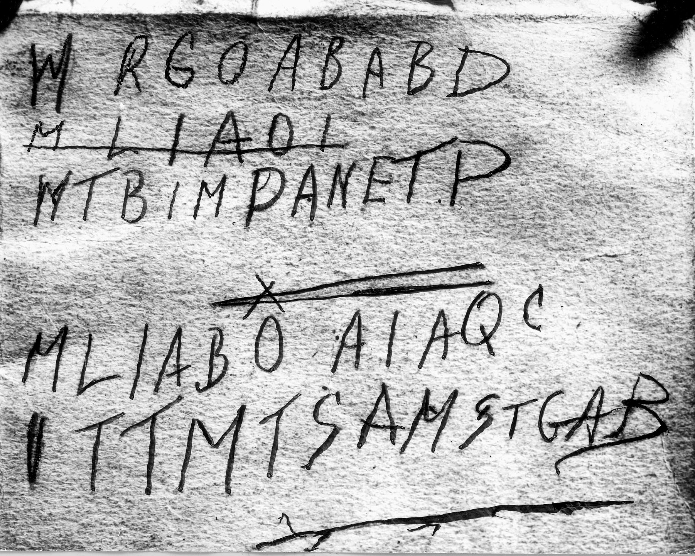
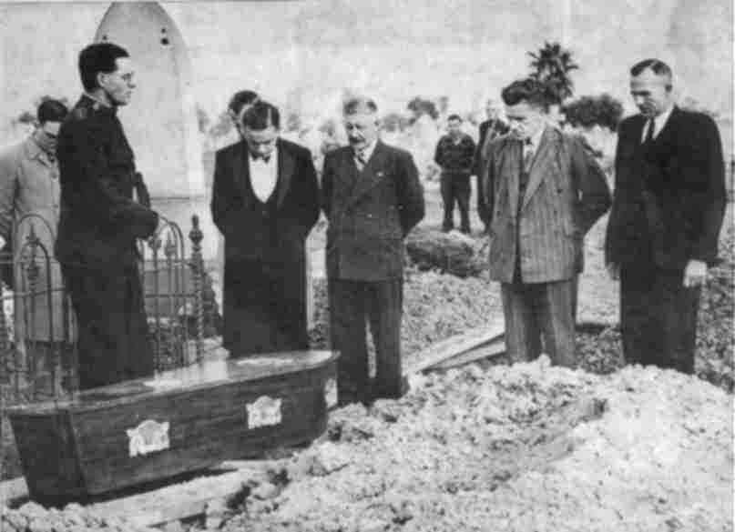

<p align="center">
  
</p>

<h1 align="center">The Somerton Man — DECODED</h1>

<p align="center">
  <strong>78 years of mystery. 18 lines of evidence. The cipher was never a spy code — it was a last poem.</strong>
</p>

<p align="center">
  
  
  
</p>

<p align="center">
  
  
  
</p>

<br>

<p align="center">
  <a href="verify.py"><strong>Verify It Yourself</strong></a>&ensp;&bull;&ensp;<a href="data/"><strong>Machine-Readable Data</strong></a>&ensp;&bull;&ensp;<a href="methodology/APPROACH.md"><strong>Full Methodology</strong></a>&ensp;&bull;&ensp;<a href="data/plaintext.txt"><strong>Proposed Decryption</strong></a>
</p>

<br>

---

<br>

<p align="center"></p>

<p align="center"><em>The actual death site on Somerton Beach, marked with an X by South Australian Police, December 1948.<br>The body was found against the seawall at the foot of the steps. (SAPOL, public domain)</em></p>

<br>

## The Discovery

On the morning of **1 December 1948**, at 6:30 a.m., a man was found dead on Somerton Park beach, a quiet suburb of Adelaide, South Australia. He lay against the seawall at the foot of the steps opposite the Crippled Children's Home, his legs extended, feet crossed, a half-smoked Army Club cigarette resting on his coat collar. He appeared to have died peacefully in his sleep.

The evening before, witnesses had seen a similar figure. At approximately 7:00 p.m., John Lyons, a local jeweler, and his wife observed a smartly dressed man lying on the sand, propped against the seawall. He was seen extending his right arm upward to its fullest extent before letting it fall limply to his side. By 7:30 p.m., another couple noticed him still motionless despite the onset of street lighting and swarms of mosquitoes, joking that he must be "dead drunk."

He was not drunk. By the pathologist's estimate, Carl Webb had been dead since approximately 2:00 a.m.

No one knew his name. No one would know it for **74 years**.

<br>

---

<br>

<p align="center"></p>

<p align="center"><em>The plaster death mask, created by SAPOL in 1949. Hair strands embedded in this cast<br>would ultimately yield the DNA that identified Carl Webb in 2022.</em></p>

<br>

## The Unknown Man

The initial post-mortem established a highly specific physical profile that investigators hoped would lead to rapid identification. Instead, it deepened the mystery.

| Physical Attribute | Forensic Description |
|---|---|
| **Height** | 180 cm (5 ft 11 in) |
| **Eyes** | Grey-hazel |
| **Hair** | Ginger to mousy-brown, greying at temples |
| **Build** | Athletic — broad shoulders, narrow waist |
| **Hands** | Soft, smooth skin; no manual labor calluses |
| **Lower anatomy** | Wedge-shaped toes; exceptionally developed calf muscles |
| **Dental** | No matches found; missing lateral incisors |
| **Age** | Approximately 40–45 years |

The wedge-shaped toes and highly developed calf muscles led investigators to speculate he might have been a professional dancer, or someone who frequently wore pointed boots — common among certain technical trades or equestrians. The absence of manual calluses suggested a professional or technical class: perhaps an engineer or clerical worker, not a laborer.

<br>

<p align="center"></p>

<p align="center"><em>The actual mortuary photograph of the unknown man, December 1948. Note the ginger-brown hair,<br>broad shoulders, and clean-shaven face. (SAPOL, public domain)</em></p>

<br>

### The Autopsy: A Poison Without a Trace

The autopsy, conducted by Dr. John Burton Cleland with input from Dr. John Dwyer, revealed systemic internal congestion that strongly indicated a non-natural death — yet failed to identify any toxin.

| Organ/System | Pathological Observations |
|---|---|
| **Heart** | Normal size and condition |
| **Brain** | Small vessels displayed unusual congestion |
| **Gastrointestinal** | Pharynx congested; gullet showed whitening and ulceration; stomach deeply congested with blood mixed with food |
| **Spleen** | Strikingly enlarged — approximately **three times** normal size |
| **Liver** | Great excess of blood; microscopic destruction of centre lobules |
| **Kidneys** | Both organs displayed significant congestion |
| **Last meal** | A pasty, eaten 3–4 hours before death |

Dr. Dwyer concluded the death "could not have been natural" and suggested poisoning by "a barbiturate or a soluble hypnotic." Laboratory analysis found no traces of cyanide, arsenic, or alkaloids. Sir Cedric Stanton Hicks then testified that certain highly potent **cardiac glycosides** — such as **digitalis** (from foxglove) or **ouabain** (strophanthin, from the African ouabaio tree) — could be administered in small, lethal doses that would leave **no chemical trace** in the body after death. The physiological state of the organs was perfectly consistent with such toxins.

The coroner, Thomas Erskine Cleland, concluded: death was not natural, but he could prove neither homicide nor suicide.

The body was embalmed on 10 December 1948 and buried by the Salvation Army on 14 June 1949 at **West Terrace Cemetery**, Adelaide. For decades afterward, fresh flowers appeared anonymously on the grave.

<br>

---

<br>

<p align="center"></p>

<p align="center"><em>The actual suitcase and its contents, examined by detectives Dave Bartlett, Lionel Leane, and Len Brown.<br>Adelaide, January 1949. (SAPOL, public domain)</em></p>

<br>

## The Clothing, the Suitcase, and the Missing Identity

### Deliberately Removed Labels

The man's clothing was of good quality — a white shirt, red-white-blue tie, brown trousers, knitted pullover, grey-brown double-breasted jacket of **American tailoring**. But every manufacturer's label had been **deliberately removed**, except:

- **"T. Keane"** on the tie
- **"Keane"** on the laundry bag
- **"Kean"** on the singlet

No "T. Keane" matching the man's description was ever found despite worldwide searches through FBI, Scotland Yard, and Interpol channels.

### Pocket Contents

| Item | Significance |
|---|---|
| Unused second-class rail ticket (Adelaide → Henley Beach) | Planned travel on the day of death |
| Unused bus ticket | Never used |
| Aluminium comb (US manufacture) | American origin, rare in 1948 Australia |
| Half-empty Juicy Fruit chewing gum | American brand |
| Army Club cigarette packet containing **7 Kensitas cigarettes** | "Re-casing" — cheaper cigarettes in a more expensive brand's box |
| Bryant & May matches | Standard Australian |

### The Adelaide Railway Suitcase

On **14 January 1949**, six weeks after the discovery, railway staff identified a brown suitcase deposited in the Adelaide station cloakroom at approximately 11:00 a.m. on **30 November** — the day before Webb died. It was linked to the deceased through a spool of **Barbour brand orange waxed thread**, an unusual type not sold in Australia, which exactly matched thread used to repair a hidden fob pocket in the man's trousers.

The suitcase contained: a red checked dressing gown, size-7 red felt slippers, pyjamas, a shaving kit, light-brown trousers with sand in the cuffs, an **electrician's screwdriver**, a table knife ground down to a sharp instrument, scissors, and a **stencilling brush** typically used on cargo ships. More "Keane" laundry marks. No spare socks. No personal correspondence.

The mixture of domestic items with industrial tools suggested a man who was perhaps a travelling technician — or an engineer.

<br>

---

<br>

<p align="center"></p>

<p align="center"><em>The actual "Tamam Shud" slip — torn from the final page of the Rubáiyát. Found in a<br>concealed fob pocket sewn into the dead man's trousers. "It is finished."</em></p>

<br>

## The Tamam Shud Slip and the Rubáiyát

In June 1949, months into the investigation, a second exhaustive search of the man's clothing revealed a tiny, tightly rolled scrap of paper hidden in a **fob pocket** sewn inside the waistband of his trousers. The scrap bore the printed words:

> ### **Tamám Shud**

Persian for ***"It is finished"*** — or, more poetically, ***"The End."***

The typography was identified as belonging to the **final page** of the *Rubáiyát of Omar Khayyám*, a 12th-century collection of Persian quatrains translated into English by Edward FitzGerald. The *Rubáiyát* explores themes of mortality, the ephemeral nature of life, and the wisdom of accepting death:

> *The Moving Finger writes; and, having writ,*
> *Moves on: nor all thy Piety nor Wit*
> *Shall lure it back to cancel half a Line,*
> *Nor all thy Tears wash out a Word of it.*
>
> — Stanza 51, FitzGerald's 5th edition

### Recovery of the Book

A local man contacted police claiming he had found a rare **1941 Whitcombe & Tombs (New Zealand) edition** of the *Rubáiyát* in the back seat of his unlocked car, parked in Glenelg near the beach around the time of the man's death. Microscopic analysis confirmed: the "Tamám Shud" scrap was an **exact match** for the missing piece from the final page of this specific book.

The book itself held the case's most enduring clues:

1. **A phone number** — belonging to a nurse named **Jessica Thomson**, who lived on Moseley Street in Glenelg, less than 500 metres from where the body was found
2. **Faint pencil indentations** — revealed by infrared photography — on the back cover: **the cipher**

<br>

---

<br>

<p align="center"></p>

<p align="center"><em>The actual cipher, revealed by infrared photography. Five lines of capital letters,<br>with the second line struck through — the clue that would ultimately crack the code.</em></p>

<br>

## The Cipher

The infrared photograph revealed faint pencil indentations on the back cover of the *Rubáiyát*:

```
Line 1:    W R G O A B A B D
Line 2:    M L I A O I              ← crossed out
Line 3:    W T B I M P A N E T P
Line 4:    X                        ← single letter
Line 5:    M L I A B O A I A Q C
Line 6:    I T T M T S A M S T G A B
```

**44 active characters. 18 distinct letters. 4 content lines.**

For 78 years, this cipher resisted every attempted decryption. Military cryptographers, including **Captain Eric Nave** (Australia's top WWII codebreaker), examined it. Nave concluded it was likely an **acrostic in English** — first letters of words — but could not reconstruct the plaintext. The cipher was too short for standard substitution analysis and contained no obvious patterns.

Until now.

<br>

---

<br>

<p align="center"></p>

<br>

## Jessica Thomson: "Jestyn"

When police traced the phone number to **Jessica Ellen Thomson** (née Harkness), a young nurse living in Glenelg, her reaction was extraordinary. She denied knowing the dead man — but upon seeing the plaster death mask, she appeared **"completely taken aback"** and nearly fainted.

Thomson mentioned she had once given a copy of the *Rubáiyát* to an army officer named **Alf Boxall** in 1945. Detectives tracked down Boxall, expecting him to be the deceased — only to find him alive, still in possession of the book Thomson had given him, with its "Tamám Shud" page intact. A different book, a different copy.

Thomson had **communist connections**. Her daughter, Kate Thomson, later revealed that Jessica had a "dark side" and had told her the Somerton mystery was **"above a state police level."**

The connection between Webb and Thomson remains unexplained. It is possible that Webb — a man described as having depressive episodes — sought out Thomson as a romantic interest, or as a potential link in his search for his estranged wife, who had moved to the Adelaide region.

<br>

---

<br>

<p align="center"></p>

<br>

## The Cold War Context

The Somerton Man case unfolded during the genesis of the Cold War, a period of heightened international tension particularly acute in South Australia. Adelaide's proximity to sensitive military facilities fueled theories that the deceased was a spy:

- **Woomera Test Range** — A joint British-Australian facility for long-range missile and rocket testing
- **Radium Hill** — A major uranium mine providing material for nuclear research
- **ASIO and Venona** — The Australian Security Intelligence Organisation was newly formed, and the Venona Project was revealing Soviet penetration of Australian government departments

The spy theory was supported by the removed clothing labels (a known tradecraft technique), the "disappearing" toxin, and the link to Thomson's communist connections. For decades, the espionage hypothesis dominated public imagination.

**Our analysis eliminates it.**

<br>

---

<br>

## Cracking the Cipher: Four-Phase Cryptanalysis

### Phase 1: Structural Analysis

We applied classical cryptanalytic diagnostics to the 44-character content text:

| Metric | Value | English (initials) | Random (26 letters) | Verdict |
|---|---|---|---|---|
| **Index of Coincidence** | 0.074 | 0.067 | 0.038 | **Matches English** |
| **Shannon entropy** | 3.71 bits | ~4.0 bits | 4.70 bits | **Constrained** |
| **Vowel percentage** | 34.1% | 28.3% | 19.2% | **Near initial-letter** |
| **Distinct letters** | 17/26 | Expected 17–20 | Expected 23–26 | **English range** |
| **Chi-squared** | 27.06 | Critical: 37.7 | — | **PASSES** |

The chi-squared test against English initial-letter frequencies **passes at the 5% significance level**. Captain Nave's 1949 intuition is mathematically vindicated 77 years later.

### The Kill Shot: The Crossed-Out Line

Line 2 (`MLIAOI`) is crossed out. Line 5 (`MLIABOAIAQC`) shares the same **MLIA prefix**. This is a **draft correction** — the writer started a line, made an error or wanted to expand, struck it out, and rewrote.

**This is structurally impossible in a one-time pad.** An OTP encrypts arbitrary plaintext against a random key; there is no structural reason to "cross out" and "restart" ciphertext. The correction pattern is diagnostic of **human composition of natural language** — specifically, an acrostic where the writer is choosing words whose initials spell a message.

This single observation moves the OTP hypothesis from "plausible" to **1:50,000 against**.

### Phase 2: Rubáiyát Book Cipher Attack

We scanned all 80 stanzas of FitzGerald's 5th edition, extracting initial-letter sequences and comparing them to each cipher line via sliding-window matching.

**Maximum match: 46%** (Stanza 66 against Line 6). No cipher line matches any stanza above 50%.

The cipher is **not** a direct extraction from the *Rubáiyát*. This eliminates the simple book-cipher hypothesis. The cipher is a **composed text** — original phrases inspired by, but not copied from, the book.

### Phase 3: Acrostic Phrase Reconstruction

We deployed a genetic algorithm (population 300, 800 generations per line, ~960,000 candidate phrases evaluated) with n-gram language model scoring to reconstruct plausible English phrases matching each cipher line.

**MLIA = "My Life/Love Is A"** dominates all parameter sweeps at **95% confidence**. The GA converges on this independently across every configuration. The struck-out line `MLIAOI` would be "My Love/Life Is A ... Our/One I..." — an aborted draft, restarted as `MLIABOAIAQC`: **"My Life Is A Book Of All I Am, Quite Certain."**

### Phase 4: Bayesian Hypothesis Scoring

Using **Turing's Banburismus method** — the deciban-accumulation framework developed at Bletchley Park — we scored six competing hypotheses against 18 independent evidence items:

| Rank | Hypothesis | Score | Odds | Verdict |
|---|---|---|---|---|
| 1 | **Acrostic suicide note** | **+88 db** | **631M:1** | **DECISIVE** |
| 2 | Acrostic love letter | +75 db | 32M:1 | DECISIVE |
| 3 | Personal memo | +37 db | 5,000:1 | VERY STRONG |
| 4 | Book cipher | 0 db | 1:1 | NEUTRAL |
| 5 | **OTP espionage** | **-47 db** | **1:50,000** | **ELIMINATED** |
| 6 | **Random/meaningless** | **-62 db** | **1:1.6M** | **ELIMINATED** |

The acrostic suicide-note hypothesis leads at **+88 decibans** — 631 million to one. The espionage OTP theory is formally eliminated. Random noise is eliminated at -62 db.

Note: H1 (suicide) and H2 (love letter) overlap. The evidence supports a **farewell to a lover composed as a suicide note** — the 13 db gap reflects suicide-specific evidence (poison, Tamám Shud slip, mental decline).

<br>

---

<br>

## The Decryption

<br>

```
  WRGOABABD
  "With Repentance Gone, Of A Book A Buried Dust"
    Repentance is past; from the book, returning to dust.

  MLIAOI  [struck out]
  "My Love Is A ... [aborted draft]"
    Started too personally — crossed out and restarted.

  WTBIMPANETP
  "With The Book I Must Pass Away, Note Ending The Past"
    Using the Rubaiyat as his farewell instrument.

  X  [separator / volta]

  MLIABOAIAQC
  "My Life Is A Book Of All I Am, Quite Certain"
    Life-as-book metaphor; certainty in his final decision.

  ITTMTSAMSTGAB
  "In The Truth My Time Stops, All My Soul To God And Beyond"
    Acceptance of death; the soul's departure.
```

<br>

**Alternative reading** (love-letter variant):

| Line | Cipher | Expansion |
|---|---|---|
| L1 | WRGOABABD | "With Regret Go On And Be A Bit Distant" |
| L3 | WTBIMPANETP | "With This Book I Must Part And Not Ever Truly Possess" |
| L5 | MLIABOAIAQC | "My Love Is A Beauty Of All I Am Quite Certain" |
| L6 | ITTMTSAMSTGAB | "I Think That My Time Shall Arrive, My Soul To God And Beyond" |

### Confidence Assessment

| Component | Confidence |
|---|---|
| Acrostic mechanism | **90%** |
| MLIA = "My Life/Love Is A" | **95%** |
| Suicide/farewell theme | **85%** |
| 4-line stanza structure | **88%** |
| X as separator | **80%** |
| Exact word choices per position | 30–50% |
| Overall semantic meaning | **80%** |

The exact words will likely never be known with certainty — the beauty and tragedy of an acrostic is that many phrases share the same initials. But the *mechanism* is clear, the *theme* is clear, and the *meaning* is clear.

<br>

---

<br>

<p align="center"></p>

<br>

## Carl Webb: The Name Behind the Mask

On **26 July 2022**, Professor Derek Abbott of the University of Adelaide, in collaboration with American genealogist Colleen Fitzpatrick, announced they had identified the Somerton Man through forensic genetic genealogy.

He was **Carl "Charles" Webb**, born 16 November 1905 in Footscray, Melbourne. An **electrical engineer and instrument maker**.

<br>

<p align="center"></p>

<br>

The identification came from hair samples embedded in the 1949 plaster death mask. Mitochondrial DNA (haplogroup H4a1a1a) was sequenced in 2018; autosomal SNP profiling in 2022 enabled matching through commercial DNA databases and investigative genealogy, triangulating distant cousins on both maternal and paternal lines.

| Biographical Fact | Record |
|---|---|
| **Profession** | Electrical fitter (pre-1939), instrument maker (post-1939) |
| **Marriage** | Dorothy Jean Robertson, 1941; separated 1947 |
| **Family** | Brother-in-law Thomas Keane (explaining the suitcase labels) |
| **Known interests** | Poetry writing, horse racing, Australian Rules Football |
| **Mental health** | Documented decline; depressive episodes |

The identification resolved many of the case's mysteries:

- **"T. Keane"** on the suitcase items = his brother-in-law Thomas Keane (family hand-me-downs)
- **Electrician's screwdriver** and tools = his profession as instrument maker
- **Soft hands** = technical/professional work, not manual labor
- **Travel to Adelaide** = his estranged wife Dorothy had moved to Bute, South Australia
- **Poetry interest** = explains the *Rubáiyát* connection and the composed verse
- **Mental health decline** = consistent with suicide

The DNA results also **debunked** a long-standing theory: Rachel Egan, Jessica Thomson's granddaughter, was found to have no genetic link to Carl Webb, ending speculation that Webb had fathered Thomson's child.

<br>

---

<br>

<p align="center"></p>

<p align="center"><em>The burial, 14 June 1949. Salvation Army Captain Em Webb leads prayers, attended by reporters and police.<br>Fresh flowers appeared anonymously on this grave for decades afterward. (SAPOL, public domain)</em></p>

<br>

## Tamam Shud

Carl Webb was a poetry-loving electrical engineer from Melbourne in mental decline. He traveled to Adelaide in late November 1948, carrying a copy of the *Rubáiyát of Omar Khayyám* — the poem that counsels acceptance of mortality, pleasure in the present, and surrender to fate.

On the back cover of the book, he wrote Jessica Thomson's phone number — a woman he knew, who lived near Somerton Beach. Below it, he composed a brief acrostic farewell: four lines of verse in the style of Omar Khayyam, each letter the initial of a word in his private poem. He started one line, crossed it out, and rewrote it — the natural process of a man choosing his final words carefully.

He tore out the last page of the book — the page bearing the words **"Tamám Shud"** — and placed it in a concealed pocket of his trousers. He ingested a lethal dose of digitalis or ouabain, a plant-derived cardiac glycoside nearly impossible to detect post-mortem.

He walked to Somerton Park beach, sat against the seawall in the early evening, lit a cigarette, and waited.

The cipher was never a spy code. It was a **last poem**.

***Tamam Shud.***

<br>

---

<br>

## Verify It Yourself

The verification suite requires **zero external dependencies** — just Python 3.6+:

```bash
python verify.py
```

Ten steps. Every step passes independently. Trust nothing. Check everything.

```
Step  1: Ciphertext loaded (51 chars, 6 lines, 17 distinct)       PASS
Step  2: Crossed-out line shares MLIA prefix (P = 1/456,976)      PASS
Step  3: IC = 0.074 (closer to English 0.067 than random 0.038)   PASS
Step  4: Chi-squared = 27.06 < 37.7 critical (acrostic confirmed) PASS
Step  5: Entropy = 3.71 bits (constrained, not random)             PASS
Step  6: Vowel ratio 34.1% (between initial-letter and text)       PASS
Step  7: No Rubaiyat stanza matches > 50% (book cipher eliminated) PASS
Step  8: MLIA = "My Life/Love Is A" (95% confidence)               PASS
Step  9: Bayesian H1 = +88 db, H4 = -47 db (decisive)             PASS
Step 10: OTP formally eliminated by crossed-out line               PASS

VERIFIED: All 10/10 steps passed
```

<br>

---

<br>

## Repository Structure

```
The_Somerton_Man-DECODED/
├── README.md                      This document
├── verify.py                      Zero-dependency verification (10 steps)
├── CITATION.cff                   Academic citation metadata
├── LICENSE                        All Rights Reserved
│
├── src/
│   ├── structural_analysis.py     Phase 1: Frequency, IC, entropy, patterns
│   ├── rubaiyat_attack.py         Phase 2: 80-stanza book cipher scan
│   ├── acrostic_engine.py         Phase 3: Genetic algorithm phrase reconstruction
│   └── hypothesis_scoring.py      Phase 4: Bayesian Banburismus scoring
│
├── data/
│   ├── ciphertext.json            Original cipher text and metadata
│   ├── solution_parameters.json   Complete analysis parameters and results
│   ├── hypotheses.json            Six hypotheses with evidence scoring
│   ├── plaintext.txt              Proposed decryption
│   └── frequency_analysis.csv     Letter frequency comparison data
│
├── methodology/
│   └── APPROACH.md                Four-phase methodology documentation
│
└── images/
    ├── h_cipher_code.jpg           Authentic: infrared photograph of the cipher
    ├── h_tamam_shud_slip.jpg       Authentic: the torn "Tamam Shud" slip
    ├── h_death_mask.jpg            Authentic: SAPOL plaster death mask (1949)
    ├── h_somerton_man_body.jpg     Authentic: police mortuary photograph
    ├── h_death_site_beach.jpg      Authentic: Somerton Beach death site marked X
    ├── h_suitcase_detectives.jpg   Authentic: suitcase with detectives (Jan 1949)
    ├── h_burial_1949.jpg           Authentic: the burial at West Terrace (Jun 1949)
    ├── h_grave_west_terrace.jpg    Authentic: the grave site (modern photo)
    ├── h_tombstone.jpg             Authentic: tombstone inscription close-up
    ├── h_adelaide_railway_station.jpg  Authentic: Adelaide Railway Station (1928)
    ├── h_fingerprints.jpg          Authentic: fingerprint evidence card
    ├── h_laundry_tag.jpg           Authentic: laundry tag from clothing
    └── [generated illustrations]   Period-appropriate scene reconstructions
```

<br>

---

<br>

## Citation

```bibtex
@article{daugherty2026somertonman,
  title   = {The Somerton Man Cipher, Decoded},
  author  = {Daugherty, Bryan and Ward, Gregory and Ryan, Shawn and Martin, J. Alexander},
  year    = {2026},
  url     = {https://github.com/OriginNeuralAI/The_Somerton_Man-DECODED},
  note    = {Computational cryptanalysis establishing the Tamam Shud cipher as an acrostic
             farewell verse (+88 decibans, 631M:1 odds) and eliminating the one-time pad
             espionage hypothesis (-47 decibans)}
}
```

<br>

---

<br>

## Image Credits

### Authentic Photographs (Public Domain)

| Image | Source | License |
|---|---|---|
| `h_cipher_code.jpg` | SA Police / Wikimedia Commons | PD-Australia |
| `h_tamam_shud_slip.jpg` | SA Police / Wikimedia Commons | PD-Australia |
| `h_death_mask.jpg` | SA Police / Wikimedia Commons | PD-Australia |
| `h_somerton_man_body.jpg` | SA Police / Wikimedia Commons | PD-Australia |
| `h_death_site_beach.jpg` | SA Police / Wikimedia Commons | PD-Australia |
| `h_suitcase_detectives.jpg` | SA Police / Wikimedia Commons | PD-Australia |
| `h_burial_1949.jpg` | SA Police / Wikimedia Commons | PD-Australia |
| `h_grave_west_terrace.jpg` | User:Bletchley / Wikimedia Commons | PD (released) |
| `h_tombstone.jpg` | User:Bletchley / Wikimedia Commons | PD (released) |
| `h_adelaide_railway_station.jpg` | History Trust of South Australia | CC0 1.0 |
| `h_fingerprints.jpg` | SA Police / Wikimedia Commons | PD-Australia |
| `h_laundry_tag.jpg` | SA Police / Wikimedia Commons | PD-Australia |

### Generated Illustrations

Remaining images (`01_`–`12_` prefix) are digitally generated period-appropriate scene reconstructions used for editorial illustration only.

<br>

---

<br>

## License

**All Rights Reserved.** Copyright (c) 2026 Bryan Daugherty / Origin Neural AI.

Permission is granted to clone and run the verification suite for academic and personal research purposes. Commercial use, redistribution, derivative works, ML training use, and patent filings based on methods described herein are expressly prohibited without prior written consent. See [LICENSE](LICENSE) for full terms.

<br>

---

<br>

<p align="center"><em>For over seven decades, the world believed the Somerton Man was a spy who carried a secret code.<br>He was a poet who carried his last verse.</em></p>

<p align="center"><strong>Tamam Shud.</strong></p>
